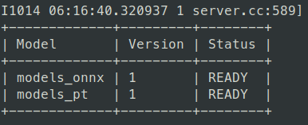

# Triton Inference

For using triton inference, we require only the trained models. Triton backend supports wide range of frameworks such as TensorRT, ONNX, PyTorch, TensorFlow, OpenVINO, DALI, FIL.


## How to run


### Triton Inference Server

To run server, we need to create `model_repository`. All the models should in following layout.

```bash
  <model-repository-path>/
    <model-name>/
      [config.pbtxt]
      [<output-labels-file> ...]
      <version>/
        <model-definition-file>
      <version>/
        <model-definition-file>
      ...
    <model-name>/
      [config.pbtxt]
      [<output-labels-file> ...]
      <version>/
        <model-definition-file>
      <version>/
        <model-definition-file>
      ...
    ...
```

One such sample for PyTorch and ONNX model is provided.

```bash
chmod +x run_triton_server.py
./run_triton_server.sh
```

One way to verify all the models are loaded is to get the following message.



### Triton Inference Client

In another terminal, create a conda environment and install the packages.

```bas
pip3 install requirements.txt -f https://download.pytorch.org/whl/lts/1.8/torch_lts.html
python image_client_pt.py -b 1 -c 3 -m models_pt examples/
```

